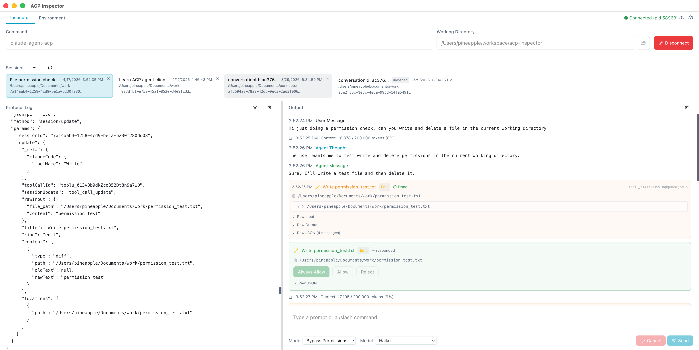

# ACP Inspector

A desktop app for testing and debugging [Agent Client Protocol (ACP)](https://agentclientprotocol.com)-compatible agents. ACP is an open protocol that standardizes how client programs (IDEs, chat apps, orchestrators) communicate with agents over JSON-RPC, enabling interoperability across tools and platforms. The ACP inspector is inspired by [MCP Inspector](https://github.com/modelcontextprotocol/inspector).



## Features

- **Connect to any ACP agent** — spawn via command line (e.g. `kiro-cli acp`, `claude-agent-acp`)
- **Full protocol log** — see every JSON-RPC message on the wire with direction indicators, method filtering, and text search
- **Interactive prompting** — send prompts, observe streaming responses, interrupt with `session/cancel`
- **Session management** — create, list, and switch between sessions
- **Permission request handling** — respond to `session/request_permission` inline
- **Agent info display** — capabilities, supported prompt types, MCP transports, auth methods
- **Environment variable management** — auto-source from login shell, manual edit, passed to agent process
- **Output grouping** — concatenates streaming chunks into readable blocks, color-coded by type

## Tested With

| Agent | Command | Link |
|---|---|---|
| Kiro CLI | `kiro-cli acp` | [kiro.dev/docs/cli/acp](https://kiro.dev/docs/cli/acp/) |
| Claude Agent ACP | `claude-agent-acp` | [npmjs.com/package/@agentclientprotocol/claude-agent-acp](https://www.npmjs.com/package/@agentclientprotocol/claude-agent-acp) |
| Gemini CLI | `gemini --acp` | [geminicli.com/docs/cli/acp-mode](https://geminicli.com/docs/cli/acp-mode/) |
| Cursor Agent | `agent acp` | [cursor.com/docs/cli/acp](https://cursor.com/docs/cli/acp) |

## Install

Download the latest release for your platform from [GitHub Releases](https://github.com/newioapp/acp-inspector/releases).

| Platform | Download |
|---|---|
| macOS (Apple Silicon) | `.dmg` (arm64) |
| macOS (Intel) | `.dmg` (x64) |
| Linux (x64) | `.AppImage` / `.deb` |
| Linux (arm64) | `.AppImage` / `.deb` |

## Development

```bash
npm install
npm run dev
```

## Build

```bash
# Local unsigned build (macOS arm64)
./scripts/build-unsigned.sh

# Local signed build (macOS arm64, requires code signing cert + keychain setup)
./scripts/build-signed.sh
```

## License

[MIT](LICENSE)
